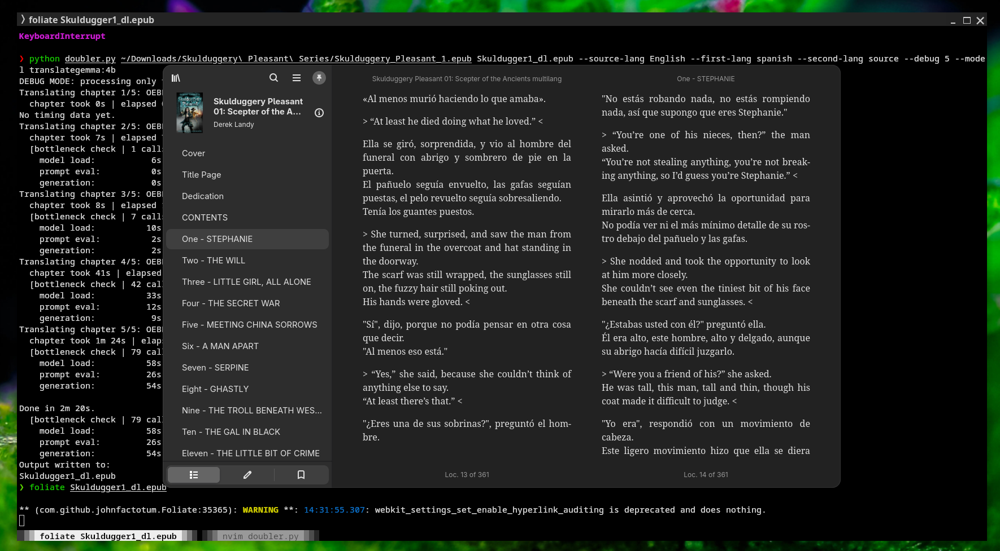

## How to use Languagedoubler

This is an AI tool that adds translations to e-books in the epub format. Features:

- Translate a full book into a different language
- Translate a full book in a different language and add the original text below each paragraph
- Add a translated paragraph below each original one

The AI uses Ollama,
so it can either use a local AI like translategemma or an API to a cloud AI like GPT or Claude.



## Get Started 
Installations (Linux)
````
pip install ebooklib beautifulsoup4 requests
curl -fsSL https://ollama.com/install.sh | sh
ollama run translategemma:4b # installing model
````
Installations (Windows)
````
pip install ebooklib beautifulsoup4 requests
irm https://ollama.com/install.ps1 | iex
ollama run translategemma:4b # installing model
````
Add a translated paragraph below each original one
````
python doubler.py test.epub ltest_trans.epub --source-lang Spanish --first-lang source --second-lang English --model translategemma:4b
````
Translate a full book in a different language
````
python doubler.py test.epub test_esp.epub --source-lang English --first-lang Spanish --second-lang none --model translategemma:4b
````
Translate a full book in a different language and add the original text below each paragraph
````
python doubler.py test.epub test_esp.epub --source-lang English --first-lang Spanish --second-lang source --model translategemma:4b
````
decent epub reader on linux
````
foliate test.epub
````

## Developer notes
## Test Ollama
 ````
curl -fsSL https://ollama.com/install.sh | sh
ollama serve
ollama run qwen2.5:0.5b "Translate to English: Hola, ¿cómo estás?"
````

